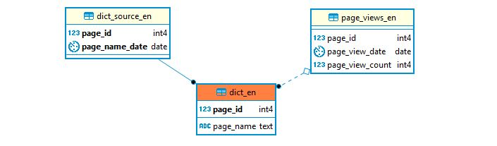

```{r setup, include=FALSE}
library(wpd)
knitr::opts_chunk$set(echo = TRUE)
```


# Database 

## Version and size

To store data for processing a PostgreSQL database was set up (Version 9.5 on Linux Ubuntu 16.04) taking up `r wpd_size()$size_human` of disk space.


## Software 

To handle scripts, tasks, helper functions, database connections, ... basically all code ... an git repository (*'wpd'*) was created entailing scripts, reports and an R-package (*'wpd'*). While reports document decissions and the general design and scripts execute specific tasks (e.g. download page titles, upload page titles, ...) most functionality and especially all logic is encapsulated in the the functions of the R-package. 


## Version Control 

Version control was set up as Git with a private remote repository hosted on Gitlab: 

- https://gitlab.com/wikidumpsplegacy/wpd 
- git@gitlab.com:wikidumpsplegacy/wpd.git


# Dictionaries

## Data processing

To have a set of valid page titles for building up a dictionary page title dumps were used. Unfortunate, page title information are only provided for the last 3 months (https://dumps.wikimedia.org/other/pagetitles/) and also dumps of the whole Wikipedia could only be found for the most recent 3 months (https://dumps.wikimedia.org/other/static_html_dumps/)

There are however page title dumps for some very early and very specific points in time 2007-2008 (https://dumps.wikimedia.org/other/static_html_dumps/). Of those early page title dumps the most recent ones (2018-07-01) were used for the dictionary tables. Unfortunate page titles for those early dumps have some weird characteristics: For random pages seemingly random character wide  hexa-decimals ahve been added - since there is no clear algorithm to decide whether or not the last 4 characters of a title are those random strings both - a cleaned up version of the title and a potential maleformed version -- have been added to the dictionaries. Later when time series data is added titles with no page views or page views below a certain threshhold will be droped. 

```{r, include=FALSE, cache=TRUE}
res <- wpd_get_queries(paste0(" select count(*) from dict_", wpd_languages, ";"))
dict_count <- format(sum(res$return.count), big.mark=",")

res2 <- wpd_get_queries(paste0(" select count(*) from dict_source_", wpd_languages, ";"))
dict_source_count <- format(sum(res2$return.count), big.mark=",")
```

All dictionary data sums up to 10 Gb of disk space and the upload of new and old page titles took around 6 hours resulting in `r dict_count` dictionary entries combined from `r dict_source_count` page titles from bath old and new page title dumps. 


To get page title information for the time in between 2008 and 2018 it was tried to find information on page history to build up graph data for page history (renames, splits and joins) with no result. 


## Basic table structure 




```sql
CREATE TABLE IF NOT EXISTS dict_en (
  page_id SERIAL PRIMARY KEY,
  page_name TEXT UNIQUE NOT NULL
);

CREATE TABLE IF NOT EXISTS dict_source_en (
  page_id INTEGER REFERENCES dict_en (page_id),
  page_name_date DATE,
  PRIMARY KEY(page_id, page_name_date)
);

CREATE TABLE IF NOT EXISTS page_views_en (
  page_id INTEGER REFERENCES dict_en (page_id),
  page_view_date DATE,
  page_view_count INTEGER
);
```

## Dictionary Upload SQL

Find below an example SQL statement for uploading dictionary data to the database. Uploads and data processing was done in badges of 250,000 titles per upload for performance and especially memory usage reasons - both within the R-session and at the database.  

```sql
  WITH dict_inserts as (
    INSERT INTO "dict_en" ("page_name")
    VALUES
      ('1996-97_los_angeles_clippers_season'),
      ('1996-97_los_angeles_kings_season'),
      ...
    ON CONFLICT (page_name) DO UPDATE set page_name = EXCLUDED.page_name RETURNING *
  )
  INSERT INTO dict_source_en
    SELECT page_id, '2018-05-12' as page_name_date FROM dict_inserts
    ON CONFLICT DO NOTHING
```


